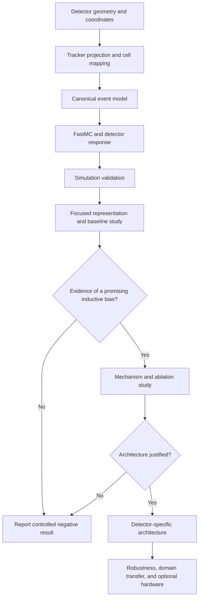

# AMS-02 ECAL QML

A physics-informed research program for simulating the AMS-02 Electromagnetic Calorimeter (ECAL) and conducting resource-matched comparisons of classical, quantum-inspired, and quantum models for electromagnetic-shower versus proton-background classification.

> **Research status:** early development. Stage I is complete: Blocks 0–3 now provide a validated simplified ECAL geometry, an immutable reconstructed-track model, straight-line projection through all 18 ECAL layer centers, alternating readout orientations, boundary-safe cell mapping, and a versioned canonical event representation with reproducibility metadata. Block 4—longitudinal electromagnetic shower modeling—is next.

## Project scope

This repository supports a **long-term research ambition**, not a commitment to implement every possible model before producing a result. The immediate objective is a narrower and feasible first study. Later architecture-development, noise, hardware, and domain-transfer stages are conditional on evidence from the earlier experiments.

The project does **not** assume that a quantum model will outperform a classical model. A rigorous negative result—showing where quantum models fail to improve upon strong controls—would still be scientifically useful.

### Long-term research direction

> Under matched data, optimization, and resource budgets, which classical, quantum-inspired, and quantum architectures are most suitable for AMS-02 ECAL proton rejection, and are there physically meaningful regimes in which quantum models provide superior predictive performance, sample efficiency, parameter efficiency, robustness, or memory-related advantages?

### First-study research question

> On a validated, track-centered representation of AMS-02 ECAL events, can a small physics-informed quantum model match or improve upon appropriately controlled compact classical models in proton rejection, sample efficiency, or parameter efficiency?

The first study will establish strong baselines, identify promising or unpromising quantum inductive biases, and determine whether a detector-specific architecture is justified. A new architecture is therefore a **conditional research outcome**, not a predetermined deliverable.

## What counts as an advantage

The project distinguishes several claims that must not be combined into a vague statement of “quantum advantage”:

1. **Predictive advantage:** better classification at a relevant detector operating point.
2. **Sample-efficiency advantage:** comparable performance using fewer labeled events.
3. **Parameter-efficiency advantage:** comparable performance using fewer trainable parameters.
4. **Robustness advantage:** reduced degradation under noise, detector perturbations, or simulation-domain shift.
5. **Computational or space advantage:** reduced memory or asymptotically favorable execution under explicitly stated assumptions.

Any claimed advantage must survive strong classical controls, repeated runs, uncertainty analysis, and comparable model-selection budgets.

## Physics scope

The AMS-02 ECAL is a three-dimensional lead–scintillating-fiber sampling calorimeter. Electrons and positrons lose energy mainly through *bremsstrahlung* and pair production, producing relatively compact electromagnetic showers. Protons interact hadronically and tend to produce more irregular, penetrating, late-starting, or only partially contained deposits.

The ECAL alone cannot determine the charge sign of an electromagnetic particle. Consequently, the detector-level classification target is

$$
e^\pm \text{ versus } p,
$$

not $e^+$ versus $e^-$. Charge-sign information belongs to the tracker.

The initial geometry model uses the following high-level detector properties:

| Quantity | Value |
|---|---:|
| Active transverse area | $648 \times 648\ \mathrm{mm}^2$ |
| Active depth | $166.5\ \mathrm{mm}$ |
| Superlayers | 9 |
| Longitudinal readout layers | 18 |
| Cells per layer | 72 |
| Nominal cell pitch | $9\ \mathrm{mm}$ |
| Electromagnetic depth | $17X_0$ |
| Hadronic depth | approximately $0.6\lambda_I$ |

The raw calorimeter representation is modeled as an alternating-view array,

$$
\mathbf{E}_{\mathrm{raw}} \in \mathbb{R}^{18 \times 72},
$$

rather than a dense $18 \times 72 \times 72$ voxel volume. Each longitudinal layer measures one transverse coordinate according to its readout orientation.

### Alternating readout and cell mapping

The configured fiber-axis sequence, ordered from the front of the ECAL toward the back, is

$$
(x,y,x,y,x,y,x,y,x)
$$

for the nine superlayers. Because each superlayer contributes two longitudinal readout layers, this expands to

$$
(x,x,y,y,x,x,y,y,x,x,y,y,x,x,y,y,x,x).
$$

The fiber axis and measured coordinate are perpendicular. For readout layer $\ell$,

$$
a_\ell =
\begin{cases}
y, & \text{if the fibers run along } x,\\
x, & \text{if the fibers run along } y.
\end{cases}
$$

After projecting a tracker state to the layer center, the selected continuous coordinate $u_\ell$ is mapped to a zero-based cell index using

$$
c_\ell =
\left\lfloor
\frac{u_\ell+324\ \mathrm{mm}}{9\ \mathrm{mm}}
\right\rfloor,
\qquad
-324\ \mathrm{mm}\leq u_\ell<324\ \mathrm{mm}.
$$

Therefore,

$$
c_\ell\in\{0,\ldots,71\}.
$$

A projection outside the half-open active interval returns `None` instead of being clamped to an edge cell. This preserves the physically meaningful possibility that an inclined track enters the front of the ECAL but leaves through a side before reaching its final layers.

Projecting one track through the detector produces an 18-entry sequence,

$$
(c_0,c_1,\ldots,c_{17}),
$$

where each entry is either a valid cell index or `None`. This sequence identifies the expected shower-axis cell in each alternating readout layer; it does not yet contain deposited energy.

A tracker-projected crop will later select a local strip around the predicted shower axis in every layer. The initial candidate is

$$
\mathbf{E}_{\mathrm{crop}} \in \mathbb{R}^{18 \times 21}.
$$

This is a layer-wise projected strip, not a conventional square image crop. The width of 21 cells is a hypothesis to be tested through containment and crop-size ablations, not an assumed optimum.

### Canonical event representation

Block 3 defines a stable, immutable event contract shared by future FastMC generation, Geant4 export, preprocessing, storage, validation, and model-input construction. One `ECALEvent` contains:

- a unique event identifier;
- primary-particle truth: `electron`, `positron`, or `proton`;
- the incident primary energy in MeV;
- the reconstructed `TrackState`;
- the validated `ECALGeometry` used to interpret the event;
- a nonnegative finite ECAL energy grid;
- versioned simulation provenance;
- an explicit event-schema version.

The canonical energy grid is

$$
\mathbf{E}
=
(E_{\ell c})
\in
\mathbb{R}_{\geq 0}^{18 \times 72},
$$

where $E_{\ell c}$ is the energy recorded in cell $c$ of readout layer $\ell$. In Python, the grid is stored as an immutable tuple of immutable layer tuples. Its dimensions are validated against the associated geometry rather than against duplicated hard-coded constants.

The incident primary energy and recorded ECAL energy are distinct quantities:

$$
E_{\mathrm{ECAL}}
=
\sum_{\ell=0}^{17}
\sum_{c=0}^{71}
E_{\ell c}.
$$

`ECALEvent` exposes both per-layer energy sums and the total ECAL energy as derived properties. It does not impose $E_{\mathrm{ECAL}}\leq E_{\mathrm{primary}}$ as a software invariant, because later detector noise, calibration effects, numerical approximations, and reconstruction corrections may alter the measured sum.

Tracker-projected cell indices are also derived from the stored track and geometry rather than stored independently. This avoids two conflicting sources of truth: a track and a separately persisted projection that could disagree.

Each event carries an `EventProvenance` record containing:

- simulation backend: `fastmc` or `geant4`;
- simulation version;
- a lowercase SHA-256 configuration digest;
- a nonnegative random seed.

The event schema is currently identified by `EVENT_SCHEMA_VERSION = 1`. Unsupported versions fail explicitly instead of being interpreted silently. Block 3 defines structure and provenance only; it does not yet generate a physical shower, model detector response, crop the event, assign an ML label, or serialize a dataset.

## Research methodology



The repository develops along three synchronized tracks:

- **Detector and dataset validity:** determine whether the simulated benchmark is scientifically credible.
- **Algorithmic benchmarking:** compare selected model families under controlled conditions.
- **Architecture discovery:** design a new model only after experiments identify reproducible beneficial components.

## Staged roadmap

### Stage I — Detector and event foundation

The first stage defines the scientific coordinate system and canonical objects used throughout the repository.

- **Block 0 — ECAL geometry:** load detector constants from configuration, derive layer and cell coordinates, and enforce geometry invariants.
- **Block 1 — Tracker state and projection:** represent an incident track and project a straight-line trajectory through ECAL layer depths.
- **Block 2 — Readout orientation and cell mapping:** encode alternating ECAL views and convert projected coordinates into valid cell indices.
- **Block 3 — Canonical event model:** define one stable event representation shared by simulation, preprocessing, storage, and machine-learning code.

**Stage I status:** complete. All later simulation backends, dataset writers, and preprocessing code are required to target the validated versioned event schema rather than introduce backend-specific event formats.

### Stage II — Physics-informed FastMC

The Fast Monte Carlo will provide a transparent and computationally inexpensive environment for learning shower physics, testing representations, and generating controlled datasets.

- **Block 4 — Longitudinal electromagnetic shower profile:** model energy deposition versus depth in radiation lengths.
- **Block 5 — Lateral shower distribution:** model transverse spreading relative to the shower axis and the Molière scale.
- **Block 6 — Stochastic event generation:** sample physically meaningful event-to-event variation with reproducible random-number control, including explicitly documented approximations for proton-event diversity.
- **Block 7 — Detector response and digitization:** model visible energy, sampling fluctuations, noise, thresholds, saturation, and calibration effects only when each component is justified.
- **Block 8 — FastMC dataset generation and validation:** generate versioned datasets and compare distributions, containment, energy response, and resolution with documented validation targets.

A credible proton model is substantially harder than an electromagnetic parameterization. Any phenomenological hadronic model will be labeled explicitly and will not be presented as equivalent to full particle transport.

**Stage exit condition:** class labels must not be inferable from accidental simulator artifacts such as incompatible energy spectra, padding conventions, seed reuse, or label-dependent detector noise.

### Stage III — Geant4 reference simulation

A separate C++/Geant4 path will provide a higher-fidelity reference and quantify the limitations of FastMC.

- **Block 9 — Geant4/C++ foundation:** establish the build system, executable structure, reproducible seeds, and run configuration.
- **Block 10 — Simplified ECAL geometry:** reproduce the documented sampling structure at the level required by the research question.
- **Block 11 — Physics list:** select and justify electromagnetic and hadronic physics processes.
- **Block 12 — Primary generation:** define particle, energy, angle, and impact-position sampling.
- **Block 13 — Sensitive detector and export:** aggregate deposits into the canonical event schema.
- **Block 14 — FastMC–Geant4 validation:** compare response, longitudinal development, lateral containment, hit multiplicity, shower start, and discriminating variables.

Geant4 output will use the same canonical schema as FastMC so downstream model comparisons do not depend on the simulation backend.

### Stage IV — Focused first study

This stage is the first intended publishable study. It deliberately limits the number of fully tuned model families.

#### Primary representations

1. **Physics-engineered features**, including longitudinal, lateral, containment, and track-consistency observables.
2. **Track-centered alternating-view strip**, initially $18 \times 21$.

Additional representations—two-view branches, layer tokens, sparse graphs, or learned latent spaces—will be explored only if the primary representation study reveals a clear need.

#### Classical and quantum-inspired baselines

The first study will establish:

- logistic regression as a sanity baseline;
- gradient-boosted decision trees on physics features;
- a compact CNN on the calorimeter strip;
- a strong CvT- or transformer-inspired reference when computationally feasible;
- a classical tensor-network or connectivity-matched hierarchical model as a control for QCNN-like inductive bias.

The purpose is not to test every classical algorithm. It is to provide simple, strong, and structurally matched controls.

#### Quantum model screening

The mandatory quantum portfolio is limited to:

- a quantum kernel with matched classical kernels;
- a variational quantum classifier with documented encoding and trainability diagnostics;
- one hierarchical quantum family, selected from a generic QCNN or quantum tree tensor network after low-cost screening.

Quantum-kernel, VQC, and hierarchical models may all be screened, but only the strongest and most stable configurations will enter the expensive confirmation stage.

#### Core experimental regimes

The first study prioritizes:

- standard same-distribution evaluation;
- low-data learning curves;
- performance across energy bins;
- class-imbalanced evaluation relevant to proton-background rejection;
- optional FastMC-to-Geant4 transfer after Stage III is validated.

Noise, real-hardware execution, comprehensive detector degradation, quantum transformers, quanvolution, quantum autoencoders, and Boltzmann-machine variants are later or separate studies rather than first-paper requirements.

### Stage V — Conditional mechanism and architecture study

A new architecture will be developed only if at least two independent experiments identify a consistent, interpretable beneficial bias—for example:

- track-centering improves both classical and quantum sample efficiency;
- alternating-view parameter sharing improves generalization;
- superlayer-aligned pooling outperforms arbitrary hierarchy;
- local data re-uploading improves trainability or low-data performance;
- the effect survives a connectivity-matched classical tensor-network control.

A candidate direction is a **track-centered alternating-view hierarchical quantum network** that:

- separates total energy from normalized shower shape;
- applies shared local encoders to layer neighborhoods;
- respects X/Y readout orientation;
- pools according to ECAL superlayer structure;
- models cross-view consistency;
- retains a small classical residual path for simple global physics variables.

This is a falsifiable architectural hypothesis, not a promised final model.

### Stage VI — Conditional robustness and execution study

Only successful finalists will proceed to:

- finite-shot evaluation;
- noise-aware simulation;
- detector perturbations and calibration shifts;
- FastMC–Geant4 domain transfer;
- hardware-topology compilation;
- limited quantum-hardware validation.

Hardware execution will validate implementation and noise trends. It will not be used to rescue a model that fails under controlled simulation.

## Dataset construction and leakage control

The data pipeline will:

1. preserve event provenance, particle type, energy, direction, simulation version, configuration hash, and random seed;
2. project the tracker state through all 18 ECAL layers;
3. map each projection to the correct alternating readout coordinate;
4. extract boundary-safe local strips;
5. fit all transformations on the training partition only;
6. produce deterministic train, validation, and test partitions;
7. prevent related events, repeated seeds, or preprocessing statistics from crossing split boundaries;
8. check that class differences are not caused by mismatched generation conditions.

Real AMS-02 flight data will be used only if a legitimate, documented source and the necessary permissions become available. Simulated data will always be identified as simulated.

## Fair-comparison protocol

Final model comparisons will be designed around four controls.

### Feature matching

Quantum and classical models receive the same input information unless the representation itself is the experimental variable.

### Capacity matching

Models will be compared at multiple approximate parameter budgets where possible. Matched compact controls and larger best-achievable classical references answer different questions and will both be reported.

### Search-budget matching

Model families will receive comparable hyperparameter trials, random seeds, early-stopping opportunities, and validation information.

### Resource reporting

Experiments will record:

- trainable and preprocessing parameter counts;
- qubit count;
- circuit depth and two-qubit gate count;
- number of circuit evaluations and shots;
- simulator or hardware backend;
- wall-clock time and peak classical memory;
- random seeds and exact configurations.

## Evaluation protocol

The primary physics endpoint is

$$
\text{proton rejection at fixed electron efficiency},
$$

with operating points such as 80%, 90%, and 95% electron efficiency reported when statistically supported.

Additional metrics include:

- ROC AUC and partial AUC in the low-background region;
- precision–recall behavior under class imbalance;
- score distributions and confusion matrices;
- calibration and Brier score when probabilities are interpreted;
- performance versus energy, incidence angle, containment, and detector boundary distance;
- learning-curve slope and sample efficiency;
- performance per parameter and per circuit evaluation;
- optimization stability and gradient behavior;
- mean performance and uncertainty across repeated seeds.

Screening experiments may use fewer seeds and reduced data. Final confirmation will freeze the test set, use repeated independent runs, report confidence intervals, and account for multiple architecture comparisons where necessary.

## Pre-registered hypotheses

The first study will test a small number of falsifiable hypotheses rather than search indefinitely for a positive result:

- **H1 — Track centering:** track-centered representations improve performance or sample efficiency over uncentered strips.
- **H2 — Alternating views:** orientation-aware models outperform architectures that treat the strip as an ordinary image.
- **H3 — Hierarchical bias:** superlayer-aligned hierarchy is more useful than arbitrary connectivity.
- **H4 — Low-data behavior:** structured compact models approach their asymptotic performance with fewer events than larger references.
- **H5 — Energy dependence:** architecture differences become more visible in difficult energy or containment regimes than in aggregate metrics.
- **H6 — Quantum specificity:** any quantum-model improvement survives comparison with a classically simulated model using the same topology.
- **H7 — Null result:** after strong controls and equal tuning, no quantum model provides a statistically meaningful improvement.

H7 is a valid scientific outcome.

## Decision gates and stopping points

The project uses explicit gates so that the broad research map does not become an obligation to implement every idea.

### Gate A — Simulation validity

Do not begin headline ML comparisons until the event distributions and detector response pass documented validation checks.

### Gate B — Representation validity

Retain only representations that demonstrate credible containment, leakage resistance, and useful classical-baseline performance.

### Gate C — Quantum feasibility

Discard quantum configurations with unstable gradients, impractical depth, excessive simulation cost, severe kernel concentration, or performance indistinguishable from trivial controls.

### Gate D — Architecture eligibility

Develop a new architecture only after multiple experiments identify a reproducible beneficial inductive bias.

### Gate E — Claim eligibility

Claims must match the evidence. Results based only on simplified simulation may support a controlled benchmark claim, not an operational state-of-the-art claim for AMS-02 flight classification.

Each gate is a valid stopping point. The project may produce a simulation paper, representation study, controlled negative QML result, benchmark paper, or architecture paper without requiring every later stage.

## Research safeguards

Scientific constants and modeling choices are intentionally separated:

- **Verified detector fact:** supported directly by an authoritative detector source.
- **Derived quantity:** calculated from documented values.
- **Modeling assumption:** introduced by the simplified simulation.
- **Validation target:** an external performance or distribution that the implementation should reproduce within a stated tolerance.

Detector constants belong in versioned configuration files such as [`configs/geometry.yaml`](configs/geometry.yaml). Python code loads, derives, and validates those values; it must not create a second undocumented source of truth.

The project will preserve:

- fixed and recorded random seeds;
- locked software environments;
- immutable experiment configurations;
- dataset and simulation provenance;
- train/test isolation;
- comparable baseline budgets;
- negative results and failed hypotheses;
- exact code, data, and configuration revisions used for reported figures and tables.

## Development approach

The repository uses a modular, object-oriented hybrid design:

- classes for physical or stateful entities;
- pure functions for numerical transformations;
- configuration files for scientific constants and assumptions;
- thin scripts for command-line entry points;
- notebooks for teaching, derivation, visualization, and validation;
- tests for invariants, boundary cases, reproducibility, and scientific contracts.

Reusable simulator logic belongs under `src/ams_ecal/`. Notebooks may explain and exercise that logic, but they must not become a competing implementation.

The repository grows one block at a time. The long-term roadmap guides scientific decisions, but future directories, placeholder modules, and unused dependencies are not created before their first real use.

## Current repository state

Blocks 0–3 are complete, closing Stage I. The repository now supports validated detector geometry, immutable reconstructed tracks, straight-line projection, alternating readout conventions, discrete cell mapping across all 18 layers, and a canonical energy-bearing event object.

The canonical event layer adds:

- immutable `ECALEvent` and `EventProvenance` dataclasses;
- a geometry-validated $18 \times 72$ nonnegative energy grid;
- primary-particle truth and incident energy;
- derived tracker-projected cells;
- derived layer and total ECAL energies;
- explicit schema versioning;
- simulation backend, version, configuration hash, and random-seed provenance;
- unit tests for valid construction, immutability, shape, numeric domains, supported categorical values, provenance, and derived quantities;
- an executable diagnostic notebook that constructs and visualizes a canonical event without presenting the artificial deposits as a physical shower.

The repository does not yet contain a physical longitudinal or lateral shower model, stochastic FastMC event generation, detector response, the $18 \times 21$ track-centered crop, or an end-to-end dataset pipeline. Those responsibilities begin with Block 4 and later stages.

| Item | Status |
|---|---|
| CPython 3.14 GIL-enabled interpreter pin | Complete |
| Reproducible `uv.lock` environment | Complete |
| Geometry configuration | Complete and schema-validated |
| Simplified ECAL geometry implementation | Complete and tested |
| Calorimetry and geometry notebook | Complete and executable |
| Immutable `TrackState` model | Complete and tested |
| Cartesian direction vector and transverse slopes | Complete and tested |
| Straight-line projection to arbitrary finite $z$ | Complete and tested |
| Projection through all 18 ECAL layer centers | Complete and notebook-validated |
| Nine-superlayer fiber-axis configuration | Complete and validated |
| Eighteen-layer fiber and measured-axis derivation | Complete and tested |
| Half-open continuous-coordinate-to-cell mapping | Complete and boundary-tested |
| Layer-specific projected-coordinate selection | Complete and tested |
| Track projection to 18 optional cell indices | Complete and tested |
| Readout orientation and cell-mapping notebook | Complete and executable |
| Canonical `ECALEvent` schema | Complete and tested |
| Immutable $18 \times 72$ energy grid validation | Complete and tested |
| Event provenance and schema versioning | Complete and tested |
| Derived layer energy, total ECAL energy, and projected cells | Complete and tested |
| Canonical event-model notebook | Complete and executable |
| Longitudinal electromagnetic shower profile | Next: Block 4 |
| Track-centered $18 \times 21$ crop | Planned after the event and shower foundations |
| Remaining FastMC and detector response | Planned: Blocks 5–8 |
| Geant4 reference simulation | Planned: Blocks 9–14 |
| Focused classical–quantum benchmark | Planned after validated simulation and preprocessing |
| Novel detector-specific architecture | Conditional on benchmark evidence |
| Quantum hardware study | Optional and conditional |

No file marked as a draft should be interpreted as a validated scientific implementation.

## Repository layout

Only currently created paths are shown:

```text
.
├── configs/
│   └── geometry.yaml
├── notebooks/
│   ├── 00_ecal_calorimetry_and_geometry.ipynb
│   ├── 01_tracker_state_and_projection.ipynb
│   ├── 02_readout_orientation_and_cell_mapping.ipynb
│   └── 03_canonical_event_model.ipynb
├── src/
│   └── ams_ecal/
│       ├── __init__.py
│       ├── event.py
│       ├── geometry.py
│       ├── readout.py
│       └── tracking.py
├── tests/
│   ├── test_event.py
│   ├── test_geometry.py
│   ├── test_readout.py
│   └── test_tracking.py
├── .gitignore
├── .python-version
├── pyproject.toml
├── README.md
└── uv.lock
```

## Environment setup

The project targets ordinary GIL-enabled CPython 3.14, not the experimental free-threaded build.

Install [uv](https://docs.astral.sh/uv/), then run:

```bash
git clone https://github.com/Chagatai404/ams-ecal-qml.git
cd ams-ecal-qml
uv python install 3.14
uv sync
uv run python --version
```

The reported interpreter should be Python 3.14 and follow the repository's `3.14+gil` pin.

To open the teaching notebooks:

```bash
uv run jupyter lab
```

Run the repository checks with:

```bash
uv run ruff check .
uv run pytest -q
```

All four notebooks should also run from beginning to end after restarting their kernels. The simulator is not yet runnable end to end: Block 3 provides the event contract, while physical shower generation begins in Block 4. Runtime scientific dependencies will be added only when the active block demonstrates a real need for them.

## References

Primary detector information and later modeling decisions will be traced to authoritative sources. Initial references include:

- [AMS-02 Electromagnetic Calorimeter overview](https://ams02.space/detector/electromagnetic-calorimeter-ecal)
- [AMS-02 ECAL reconstruction description](https://ams02.space/advances-data-analysis/new-reconstruction-method-electromagnetic-calorimeter-ecal-analysis)
- [Particle Data Group reviews](https://pdg.lbl.gov/)

Algorithmic and QML papers will be recorded in a structured literature matrix that captures the task, data, representation, preprocessing, quantum resources, classical controls, validation protocol, noise model, claims, and unresolved weaknesses. References will be cited next to the equations, parameters, architectural decisions, or validation targets they support.

## Independence and limitations

This is an independent academic research project. It is not an official AMS Collaboration software package and is not endorsed by AMS-02, CERN, NASA, or the International Space Station program.

Until validated against authoritative references and a higher-fidelity simulation, generated events must be treated as research approximations. Any eventual conclusions will be limited by simulation fidelity, dataset construction, preprocessing choices, finite sample size, classical-control strength, quantum simulation scale, and access to representative data.
