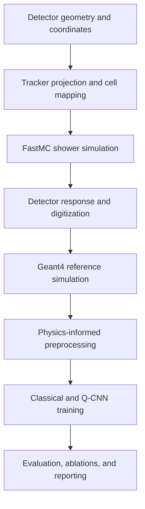

# AMS-02 ECAL QML

A physics-informed research project for simulating the AMS-02 Electromagnetic Calorimeter (ECAL) and benchmarking quantum convolutional neural networks against classical models for electromagnetic-shower versus proton-background classification.

> **Research status:** early development. Blocks 0 and 1 are complete: the repository now includes a validated simplified ECAL geometry, an immutable reconstructed-track model, and continuous straight-line projection through all 18 ECAL layer centers. Block 2—alternating readout orientation and cell mapping—is next.

## Research objective

The long-term objective is to investigate whether a hybrid quantum convolutional neural network (Q-CNN) can learn useful shower-shape structure from a compact, physics-informed representation of AMS-02 ECAL events.

The central research question is:

> Under controlled and reproducible simulation conditions, how does a Q-CNN compare with appropriately matched classical baselines when separating electron/positron electromagnetic showers from cosmic-ray proton backgrounds?

The project does **not** assume that a quantum model will outperform a classical one. The intended contribution is a careful comparison that reports predictive performance, resource requirements, stability, and limitations without claiming quantum advantage unless the evidence supports it.

## Physics scope

The AMS-02 ECAL is a three-dimensional lead–scintillating-fiber sampling calorimeter. Electrons and positrons lose energy mainly through bremsstrahlung and pair production, producing relatively compact electromagnetic showers. Protons interact hadronically and tend to produce more irregular, penetrating, or only partially contained energy deposits.

The ECAL alone cannot determine the sign of an electromagnetic particle. Consequently, the detector-level classification target is

$$
e^\pm \text{ versus } p,
$$

not $e^+$ versus $e^-$. Charge-sign information belongs to the tracker.

The initial geometry model is based on the following high-level detector properties:

| Quantity | Value |
|---|---:|
| Active transverse area | $648 \times 648\ \mathrm{mm}^2$ |
| Active depth | $166.5\ \mathrm{mm}$ |
| Superlayers | 9 |
| Longitudinal readout layers | 18 |
| Cells per layer | 72 |
| Nominal cell pitch | $9\ \mathrm{mm}$ |
| Electromagnetic depth | $17X_0$ |
| Hadronic depth | approximately $0.6\lambda_I$ |

The raw calorimeter representation is modeled as an alternating-view array,

$$
\mathbf{E}_{\mathrm{raw}} \in \mathbb{R}^{18 \times 72},
$$

rather than a dense $18 \times 72 \times 72$ voxel volume. Each longitudinal layer measures one transverse coordinate according to its readout orientation.

A tracker-projected crop will later select 21 cells around the predicted shower axis in every layer:

$$
\mathbf{E}_{\mathrm{crop}} \in \mathbb{R}^{18 \times 21}.
$$

This is a layer-wise projected strip, not a conventional square image crop. The proposed width will be tested through containment studies and crop-size ablations rather than treated as automatically optimal.

## End-to-end methodology



### 1. Detector and event foundation

The project is segmented into small building blocks. The first stage defines the scientific coordinate system and the canonical objects used throughout the repository.

- **Block 0 — ECAL geometry:** load detector constants from configuration, derive layer and cell coordinates, and enforce geometry invariants.
- **Block 1 — Tracker state and projection:** represent an incident track and project a straight-line trajectory through ECAL layer depths.
- **Block 2 — Readout orientation and cell mapping:** encode alternating ECAL views and convert projected coordinates into valid cell indices.
- **Block 3 — Canonical event model:** define one stable event representation shared by simulation, preprocessing, storage, and machine-learning code.

### 2. Physics-informed FastMC

The Fast Monte Carlo will provide a transparent and computationally inexpensive environment for learning the shower physics, testing representations, and generating controlled datasets.

- **Block 4 — Longitudinal electromagnetic shower profile:** model energy deposition versus depth in radiation lengths.
- **Block 5 — Lateral shower distribution:** model transverse spreading relative to the shower axis and the Molière scale.
- **Block 6 — Stochastic event generation:** sample physically meaningful event-to-event variation with reproducible random-number control.
- **Block 7 — Detector response and digitization:** model visible energy, sampling fluctuations, noise, thresholds, saturation, and calibration effects only when each component is justified.
- **Block 8 — FastMC dataset generation and validation:** generate versioned datasets and compare distributions, containment, energy response, and resolution with documented validation targets.

A credible proton model is substantially harder than an electromagnetic parameterization. Any simplified hadronic model will be labeled explicitly and will not be presented as equivalent to a full particle-transport simulation.

### 3. Geant4 reference simulation

A separate C++/Geant4 path will provide a higher-fidelity reference and a way to quantify the limitations of FastMC.

- **Block 9 — Geant4/C++ foundation:** establish the build system, executable structure, reproducible seeds, and run configuration.
- **Block 10 — Simplified ECAL geometry:** reproduce the documented sampling structure at the level needed for the research question.
- **Block 11 — Physics list:** select and justify electromagnetic and hadronic physics processes.
- Add primary-particle generation, sensitive-detector scoring, event export, and validation only after the foundation is verified.
- Compare FastMC and Geant4 observables before using either source for final model claims.

Geant4 output will be translated into the same canonical event schema as FastMC so downstream preprocessing and model evaluation do not depend on the simulation backend.

### 4. Dataset construction and preprocessing

The data pipeline will:

1. preserve event provenance, particle type, energy, direction, simulation version, configuration hash, and random seed;
2. project the tracker state through all 18 ECAL layers;
3. map each projection to the correct alternating readout coordinate;
4. extract a boundary-safe $18 \times 21$ crop;
5. apply transformations fitted on the training partition only;
6. produce deterministic train, validation, and test splits;
7. prevent duplicated seeds, related events, or preprocessing statistics from leaking across splits.

The primary 21-cell crop will be challenged through a crop-width ablation. Energy scaling, normalization, compression, and feature selection will also be treated as experimental choices rather than hidden preprocessing.

Real AMS-02 flight data will be used only if a legitimate, documented source and the necessary permissions become available. Simulated data will always be identified as simulated.

### 5. Classical baselines

Classical models establish whether the representation itself is informative and provide the comparison required to interpret a QML result. Candidate baselines include:

- logistic regression or another simple linear classifier;
- a multilayer perceptron;
- a compact convolutional neural network;
- parameter-matched or capacity-aware controls for the Q-CNN.

Hyperparameter search budgets, early stopping, preprocessing, data splits, and evaluation rules will be kept as comparable as practical across model families.

### 6. Quantum representation and Q-CNN

Because an $18 \times 21$ crop contains 378 values, it cannot be mapped naively to a small near-term circuit without a deliberate compression or encoding strategy. The quantum stage will therefore document:

- the classical feature-reduction step, if used;
- the number of qubits and encoded features;
- the data-encoding map and its scaling domain;
- convolution and pooling circuit ansätze;
- parameter sharing and circuit depth;
- measurement observables and classical readout;
- differentiation method, optimizer, initialization, and shot model;
- simulator or hardware backend and all execution settings.

The Q-CNN will first be evaluated on a noiseless simulator. Finite-shot and noise-aware experiments may follow as separate conditions. Hardware results, if attempted, will not be mixed silently with simulator results.

### 7. Evaluation and benchmarking

The final comparison will report more than a single accuracy value.

**Physics and classification metrics**

- ROC AUC;
- proton rejection at fixed electron efficiency;
- precision–recall behavior under class imbalance;
- confusion matrices and score distributions;
- calibration where probabilistic scores are interpreted;
- performance versus energy, incidence angle, containment, and boundary proximity.

**Training and resource metrics**

- trainable parameter count;
- qubit count, circuit depth, and two-qubit gate count;
- optimization stability and gradient behavior;
- wall-clock and execution cost;
- mean performance and uncertainty across multiple random seeds.

**Planned ablations**

- crop width and containment;
- tracker-centered versus alternative centering;
- preprocessing and feature compression;
- encoding map;
- circuit depth and pooling;
- finite-shot sampling and noise;
- FastMC versus Geant4 training and evaluation domains.

Statistical uncertainty, repeated runs, and confidence intervals will be reported wherever they are needed to distinguish a real effect from seed variation.

## Research safeguards

Scientific constants and modeling choices are intentionally separated:

- **Verified detector fact:** supported directly by an authoritative detector source.
- **Derived quantity:** calculated from documented values.
- **Modeling assumption:** introduced by this simplified simulation.
- **Validation target:** an external performance or distribution that the implementation should reproduce within a stated tolerance.

Detector constants belong in versioned configuration files such as [`configs/geometry.yaml`](configs/geometry.yaml). Python code loads, derives, and validates those values; it should not create a second undocumented source of truth.

The project will also preserve:

- fixed and recorded random seeds;
- locked software environments;
- immutable experiment configurations;
- dataset and simulation provenance;
- train/test isolation;
- comparable baseline budgets;
- negative results and failed hypotheses;
- exact code and configuration revisions used for reported figures and tables.

## Development approach

The repository uses a modular, object-oriented hybrid design:

- classes for physical or stateful entities;
- pure functions for numerical transformations;
- configuration files for scientific constants and assumptions;
- thin scripts for command-line entry points;
- notebooks for teaching, derivation, visualization, and validation;
- tests for invariants, boundary cases, reproducibility, and scientific contracts.

Reusable simulator logic belongs under `src/ams_ecal/`. Notebooks may explain and exercise that logic, but they must not become a competing implementation.

The repository grows one block at a time. Future directories and placeholder modules are not created before their first real use.

## Current repository state

Blocks 0 and 1 are complete. The repository currently supports continuous detector geometry and straight-line tracker projection. It does not yet assign readout views or discrete ECAL cell indices; those operations begin in Block 2.

| Item | Status |
|---|---|
| CPython 3.14 GIL-enabled interpreter pin | Complete |
| Reproducible `uv.lock` environment | Complete |
| Geometry configuration | Complete and schema-validated |
| Simplified ECAL geometry implementation | Complete and tested |
| Calorimetry and geometry notebook | Complete and executable |
| Geometry invariant tests | Complete |
| Immutable `TrackState` model | Complete and tested |
| Cartesian direction vector and transverse slopes | Complete and tested |
| Pure straight-line projection to arbitrary finite $z$ | Complete and tested |
| Projection through all 18 ECAL layer centers | Complete and notebook-validated |
| Tracker-state and projection notebook | Complete and executable |
| Alternating readout orientation and cell mapping | Next: Block 2 |
| Shower simulation and detector response | Planned: Blocks 4–8 |
| Geant4 reference simulation | Planned: Blocks 9–11 and later extensions |
| Classical and quantum ML models | Planned after validated simulation and preprocessing |

No file marked as a draft should be interpreted as a validated scientific implementation.

## Repository layout

Only currently created paths are shown:

```text
.
├── configs/
│   └── geometry.yaml
├── notebooks/
│   ├── 00_ecal_calorimetry_and_geometry.ipynb
│   └── 01_tracker_state_and_projection.ipynb
├── src/
│   └── ams_ecal/
│       ├── __init__.py
│       ├── geometry.py
│       └── tracking.py
├── tests/
│   ├── test_geometry.py
│   └── test_tracking.py
├── .gitignore
├── .python-version
├── pyproject.toml
├── README.md
└── uv.lock
```

## Environment setup

The project targets ordinary GIL-enabled CPython 3.14, not the experimental free-threaded build.

Install [uv](https://docs.astral.sh/uv/), then run:

```bash
git clone https://github.com/Chagatai404/ams-ecal-qml.git
cd ams-ecal-qml
uv python install 3.14
uv sync
uv run python --version
```

The reported interpreter should be Python 3.14 and follow the repository's `3.14+gil` pin.

To open the teaching notebooks:

```bash
uv run jupyter lab
```

Run the repository checks with:

```bash
uv run ruff check .
uv run pytest -q
```

Both notebooks should also run from beginning to end after restarting their kernels. The simulator is not yet runnable end to end. Runtime scientific dependencies will be added only when the active block demonstrates a real need for them.

## References

Primary detector information and later modeling decisions will be traced to authoritative sources. Initial references include:

- [AMS-02 Electromagnetic Calorimeter overview](https://ams02.space/detector/electromagnetic-calorimeter-ecal)
- [AMS-02 ECAL reconstruction description](https://ams02.space/advances-data-analysis/new-reconstruction-method-electromagnetic-calorimeter-ecal-analysis)
- [Particle Data Group reviews](https://pdg.lbl.gov/)

Additional papers will be cited next to the equations, parameters, or validation targets they support.

## Independence and limitations

This is an independent academic research project. It is not an official AMS Collaboration software package and is not endorsed by AMS-02, CERN, NASA, or the International Space Station program.

Until validated against authoritative references and a higher-fidelity simulation, generated events must be treated as research approximations. Any eventual conclusions will be limited by simulation fidelity, dataset construction, preprocessing choices, finite sample size, and the scale of the quantum experiments.
