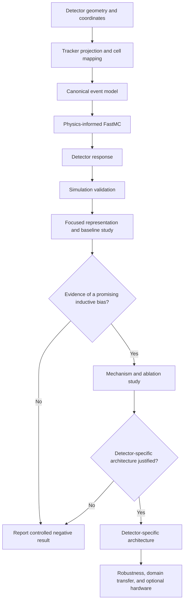

# AMS-02 ECAL QML

A physics-informed research program for simulating the AMS-02 Electromagnetic
Calorimeter (ECAL) and conducting resource-matched comparisons of classical,
quantum-inspired, and quantum models for electromagnetic-shower versus
proton-background classification.

> **Research status:** Stage I is complete. A pre-Block-4 **Geometry Fidelity
> Pass** now upgrades the detector description to schema v2 while preserving
> the validated Stage-I interfaces. The repository represents the documented
> ECAL readout topology, physical lead/fiber sampling structure, effective
> material properties, and finite longitudinal readout intervals. Detector
> imperfections remain deliberately separate. **Block 4 — longitudinal
> electromagnetic shower modeling — is next.**

## Project scope

This repository supports a long-term research program rather than assuming in
advance that a quantum model will outperform a classical one.

The immediate scientific objective is to build a detector-faithful simulation
and preprocessing pipeline, establish strong classical controls, and then test
small quantum and quantum-inspired models under matched data and resource
budgets.

A controlled negative result is considered scientifically useful.

### Long-term research direction

> Under matched data, optimization, and resource budgets, which classical,
> quantum-inspired, and quantum architectures are most suitable for AMS-02 ECAL
> proton rejection, and are there physically meaningful regimes in which
> quantum models provide superior predictive performance, sample efficiency,
> parameter efficiency, robustness, or memory-related advantages?

### First-study research question

> On a validated, track-centered representation of AMS-02 ECAL events, can a
> small physics-informed quantum model match or improve upon appropriately
> controlled compact classical models in proton rejection, sample efficiency,
> or parameter efficiency?

A new detector-specific architecture is a **conditional research outcome**, not
a predetermined deliverable.

## What counts as an advantage

The project separates several possible claims:

1. **Predictive advantage:** better classification at a relevant detector
   operating point.
2. **Sample-efficiency advantage:** comparable performance using fewer labeled
   events.
3. **Parameter-efficiency advantage:** comparable performance using fewer
   trainable parameters.
4. **Robustness advantage:** reduced degradation under noise, detector
   perturbations, or simulation-domain shift.
5. **Computational or space advantage:** reduced memory or asymptotically
   favorable execution under explicitly stated assumptions.

Any claimed advantage must survive strong classical controls, repeated runs,
uncertainty analysis, and comparable model-selection budgets.

---

# Physics scope

The AMS-02 ECAL is a three-dimensional lead–scintillating-fiber sampling
calorimeter.

Electrons and positrons lose energy primarily through electromagnetic shower
processes such as bremsstrahlung and pair production. Protons interact
hadronically and tend to produce more irregular, penetrating, late-starting, or
partially contained deposits.

The ECAL alone does not determine the charge sign of an electromagnetic
particle. The detector-level target is therefore:

`e± versus p`

rather than `e+ versus e-`.

Charge-sign information belongs to the tracker.

## ECAL readout representation

The canonical raw calorimeter representation is:

`18 longitudinal samplings × 72 transverse cells`

rather than a dense three-dimensional voxel volume.

Each longitudinal sampling measures one transverse coordinate according to the
fiber orientation of its parent superlayer.

### High-level detector quantities

| Quantity | Nominal value |
|---|---:|
| Active readout area | 648 × 648 mm² |
| Active depth | 166.5 mm |
| Superlayers | 9 |
| Longitudinal readout samplings | 18 |
| Cells per sampling | 72 |
| Total readout cells | 1296 |
| Nominal cell pitch | 9 mm |
| Photomultipliers | 324 |
| Anodes per photomultiplier | 4 |
| Electromagnetic depth | 17 X₀ |
| Hadronic depth | approximately 0.6 λᵢ |
| Superlayer thickness | 18.5 mm |
| Approximate fibers per readout cell | 35 |
| Effective bulk density | 6.8 g/cm³ |
| Effective critical energy | 7.6 MeV |

The code independently checks that:

`18 × 72 = 324 × 4 = 1296`

and that:

`9 × 18.5 mm = 166.5 mm`

These cross-checks are scientific invariants rather than duplicated constants.

---

# Geometry Fidelity Pass

The original Block-0 geometry was intentionally minimal. It captured the
readout dimensions and coordinate conventions needed by tracking and cell
mapping.

Before beginning FastMC shower physics, the detector description is upgraded
to a structured **schema-v2 ideal ECAL geometry**.

## Structured geometry model

`ECALGeometry` is composed from immutable configurable objects:

```text
ECALGeometry
├── ActiveVolume
├── ReadoutGeometry
├── SamplingStructure
├── MaterialProperties
├── MaterialDepth
└── CoordinateSystem
```

This keeps conceptually different detector information separate while still
allowing the complete geometry to enforce relationships between components.

Existing Blocks 0–3 continue to use compatibility properties such as:

```python
geometry.number_of_layers
geometry.cells_per_layer
geometry.total_depth_x0
geometry.uniform_layer_centers_z_mm
```

New Stage-II code can access the more structured API:

```python
geometry.readout.cells_per_layer
geometry.sampling_structure.fiber_diameter_mm
geometry.material_properties.effective_critical_energy_mev
geometry.material_depth.total_depth_x0
```

This prevents the fidelity upgrade from destabilizing already validated code.

## Physical sampling structure

The geometry configuration records the nominal lead/fiber construction used by
the ideal simulation:

- 9 superlayers;
- 18.5 mm per superlayer;
- 11 absorber-foil positions per superlayer;
- 10 scintillating-fiber planes per superlayer;
- approximately 1 mm absorber-foil thickness;
- approximately 1 mm fiber diameter;
- approximately 1.35 mm horizontal fiber pitch;
- approximately 1.73 mm fiber-row spacing;
- neighboring fiber rows staggered by half a pitch;
- lead as the standard absorber;
- aluminum for the terminal foil.

Across all nine superlayers there are 99 absorber-foil positions. The terminal
foil is aluminum, giving:

```text
98 lead foils
1 aluminum terminal foil
```

The detector is a composite structure. Fiber diameter and foil thickness must
**not** be added as if the detector were a simple stack of non-overlapping flat
slabs; the fibers are embedded in the grooved absorber structure.

## Composite material properties

The configuration stores the reported relative volume composition:

```text
lead : scintillating fiber : optical glue
1.00 : 0.57 : 0.15
```

The values are kept as a relative ratio. `MaterialProperties` derives normalized
fractions only when a calculation requires them.

The ideal geometry also stores:

- effective average density: 6.8 g/cm³;
- effective critical energy: 7.6 MeV;
- total depth: 17 X₀;
- nominal hadronic depth: approximately 0.6 λᵢ.

The effective critical energy is a detector-level material property that Block 4
will use when parameterizing electromagnetic shower development.

The interaction-length value is retained as a nominal detector quantity and
will be revisited carefully before phenomenological proton modeling.

## Longitudinal sampling intervals

The 18 readout samplings are treated as **effective longitudinal intervals**,
not as 18 homogeneous physical material slabs.

The ideal uniform longitudinal granularity is:

```text
166.5 mm / 18 = 9.25 mm per readout sampling
```

and:

```text
17 X₀ / 18 ≈ 0.94444 X₀ per readout sampling
```

`ECALGeometry.uniform_layer_bounds_x0` exposes the finite radiation-length
interval associated with every readout sampling.

This matters for Block 4.

A continuous longitudinal shower profile will be **integrated over each finite
readout interval** rather than evaluated only at a single layer-center point.

That provides the correct mathematical bridge between a continuous energy
deposition density and the discrete 18-layer calorimeter representation.

## Ideal detector versus detector conditions

The base geometry describes the **nominal ideal detector**.

It intentionally does not include:

- electronic noise;
- photoelectron statistics;
- channel-to-channel gain variation;
- optical attenuation;
- fiber saturation;
- electronics saturation;
- thresholds;
- dead or noisy channels;
- time-dependent calibration;
- temperature-dependent response;
- tracker–ECAL misalignment;
- flight-era alignment corrections;
- run-dependent detector conditions.

These effects are not forgotten. They belong to later detector-response and
conditions models.

The intended simulation architecture is:

```text
Primary particle
      │
      ▼
Ideal shower physics
      │
      ▼
Nominal AMS-02 ECAL geometry
      │
      ▼
Ideal cell energy deposits
      │
      ├─────────────────────────────┐
      │                             │
      ▼                             ▼
Ideal reference output       Detector-response model
                                    │
                              noise / sampling
                              attenuation
                              saturation
                              thresholds
                                    │
                                    ▼
                              Detector conditions
                              gains
                              dead channels
                              alignment
                              calibration
```

This separation allows the project to establish a clean theoretical baseline
first and introduce flight-like complications later without changing the
underlying shower physics.

---

# Alternating readout and cell mapping

The configured superlayer fiber-axis sequence, ordered from the front of the
ECAL toward the back, is:

```text
x, y, x, y, x, y, x, y, x
```

Each superlayer contributes two longitudinal samplings, giving:

```text
x, x, y, y, x, x, y, y, x, x, y, y, x, x, y, y, x, x
```

The fiber direction and measured transverse coordinate are perpendicular.

Therefore:

```text
x-directed fibers → measure y
y-directed fibers → measure x
```

After projecting a tracker state to a layer center, the selected transverse
coordinate is mapped onto the half-open active readout interval.

For a 648 mm active width and 9 mm pitch, valid cell indices are:

```text
0 ... 71
```

A projection outside the active interval returns `None` rather than being
clamped to an edge cell.

This preserves the physically meaningful case where an inclined trajectory
enters the front of the ECAL but leaves through a side before reaching the final
layers.

Projecting one track through the detector therefore produces an 18-entry
sequence of either valid cell indices or `None`.

This sequence defines the expected shower-axis cell for every alternating
readout sampling. It does not yet represent deposited energy.

---

# Canonical event representation

Block 3 defines a stable event contract shared by:

- FastMC;
- Geant4 export;
- preprocessing;
- dataset serialization;
- validation;
- machine-learning input construction.

An `ECALEvent` stores:

- a unique event identifier;
- primary particle truth: `electron`, `positron`, or `proton`;
- primary energy in MeV;
- reconstructed `TrackState`;
- validated `ECALGeometry`;
- nonnegative finite ECAL cell energies;
- versioned simulation provenance;
- event schema version.

The canonical energy grid has shape:

```text
18 × 72
```

with one energy value for every longitudinal sampling and transverse cell.

The primary energy and recorded ECAL energy are deliberately distinct
quantities.

`ECALEvent` exposes:

- per-layer energy sums;
- total ECAL energy;
- tracker-projected cell indices.

Projected cell indices are derived from the stored track and geometry rather
than stored independently. This avoids conflicting sources of truth.

`EventProvenance` records:

- simulation backend: `fastmc` or `geant4`;
- simulation version;
- configuration SHA-256;
- random seed.

The event schema is currently version 1.

Block 3 defines structure and provenance only. It does not yet generate a
physical shower.

---

# Research methodology



The repository develops along three synchronized tracks:

- **Detector and dataset validity:** determine whether the simulated benchmark is
  scientifically credible.
- **Algorithmic benchmarking:** compare model families under controlled
  conditions.
- **Architecture discovery:** design a new architecture only after experiments
  identify reproducible beneficial inductive biases.

---

# Staged roadmap

## Stage I — Detector and event foundation

Stage I defines the scientific coordinate system and canonical objects used
throughout the repository.

- **Block 0 — ECAL geometry:** load detector constants, derive layer/cell
  coordinates, and enforce geometry invariants.
- **Block 1 — Tracker state and projection:** represent an incident track and
  project a straight-line trajectory through ECAL layer centers.
- **Block 2 — Readout orientation and cell mapping:** encode alternating ECAL
  views and convert projected coordinates into valid cell indices.
- **Block 3 — Canonical event model:** define one stable event representation
  shared by simulation, preprocessing, storage, and ML code.

**Stage I status: complete.**

### Pre-Block-4 Geometry Fidelity Pass

The geometry fidelity pass:

- upgrades `configs/geometry.yaml` to schema v2;
- introduces structured immutable geometry components;
- records the physical lead/fiber sampling structure;
- stores effective composite material properties;
- checks detector cross-component invariants;
- preserves the Stage-I flat geometry API;
- introduces finite layer bounds in radiation lengths;
- explicitly separates ideal detector geometry from detector conditions;
- adds `notebooks/04_ecal_geometry_fidelity.ipynb`.

**Geometry fidelity status: complete.**

## Stage II — Physics-informed FastMC

The Fast Monte Carlo provides a transparent and computationally inexpensive
environment for learning shower physics, testing representations, and generating
controlled datasets.

- **Block 4 — Longitudinal electromagnetic shower profile:** model energy
  deposition versus depth in radiation lengths using a configurable shower
  model and finite layer integration.
- **Block 5 — Lateral shower distribution:** model transverse spread relative
  to the tracker-projected shower axis and Molière scale.
- **Block 6 — Stochastic event generation:** introduce physically meaningful
  event-to-event fluctuations with reproducible random-number control,
  including explicitly documented approximations for proton-event diversity.
- **Block 7 — Detector response and digitization:** introduce visible-energy
  response, sampling fluctuations, noise, thresholds, saturation, calibration,
  and other detector complications only when justified.
- **Block 8 — FastMC dataset generation and validation:** generate versioned
  datasets and compare response, containment, resolution, and discriminating
  distributions with documented validation targets.

A phenomenological proton model will never be presented as equivalent to full
hadronic particle transport.

**Stage-II exit condition:** class labels must not be inferable from accidental
simulator artifacts such as incompatible energy spectra, padding conventions,
seed reuse, or label-dependent detector response.

## Stage III — Geant4 reference simulation

A separate C++/Geant4 path will provide a higher-fidelity transport reference
and quantify limitations of FastMC.

- **Block 9 — Geant4/C++ foundation**
- **Block 10 — ECAL geometry implementation**
- **Block 11 — Physics-list selection**
- **Block 12 — Primary generation**
- **Block 13 — Sensitive detector and canonical export**
- **Block 14 — FastMC–Geant4 validation**

Geant4 output will target the same canonical event schema as FastMC.

## Stage IV — Focused first study

This is the first intended publishable ML study.

### Primary representations

1. physics-engineered longitudinal, lateral, containment, and track-consistency
   features;
2. a track-centered alternating-view strip, initially `18 × 21`.

Additional representations will be introduced only when experiments establish a
clear need.

### Classical and quantum-inspired controls

The study will establish:

- logistic regression;
- gradient-boosted decision trees;
- a compact CNN;
- a strong transformer/CvT-inspired reference when feasible;
- a connectivity-matched classical hierarchical or tensor-network control.

### Quantum model screening

The initial quantum portfolio is limited to:

- a quantum kernel with matched classical kernels;
- a variational quantum classifier;
- one hierarchical quantum family selected after low-cost screening.

### Core experimental regimes

The first study prioritizes:

- same-distribution evaluation;
- low-data learning curves;
- energy-binned performance;
- strongly class-imbalanced proton rejection;
- optional FastMC-to-Geant4 domain transfer after Stage III.

## Stage V — Conditional mechanism and architecture study

A new architecture will be developed only if multiple experiments identify a
consistent and interpretable beneficial bias.

Candidate detector-specific ideas include:

- track centering;
- orientation-aware X/Y processing;
- superlayer-aligned pooling;
- cross-view consistency;
- local data re-uploading;
- detector-topology-aware quantum connectivity.

These remain hypotheses rather than promised architecture features.

## Stage VI — Conditional robustness and execution study

Only successful finalists proceed to:

- finite-shot evaluation;
- noise-aware quantum simulation;
- detector perturbations;
- calibration shifts;
- FastMC–Geant4 domain transfer;
- hardware-topology compilation;
- limited quantum-hardware validation.

---

# Dataset construction and leakage control

The data pipeline will:

1. preserve event provenance, particle type, energy, direction, simulation
   version, configuration hash, and random seed;
2. project the tracker state through all 18 ECAL samplings;
3. map each projection using the correct alternating readout coordinate;
4. extract boundary-safe local strips;
5. fit all learned transformations on the training partition only;
6. produce deterministic train, validation, and test partitions;
7. prevent related events or repeated seeds from crossing split boundaries;
8. prevent preprocessing statistics from crossing split boundaries;
9. verify that class differences are not caused by mismatched generation
   conditions.

Real AMS-02 flight data will be used only through a legitimate documented source
and with any required permissions.

Simulated data will always be identified as simulated.

---

# Fair-comparison protocol

## Feature matching

Quantum and classical models receive the same input information unless the
representation itself is the experimental variable.

## Capacity matching

Models will be compared at multiple approximate parameter budgets where
possible.

Matched compact controls and larger best-achievable classical references answer
different questions and will both be reported.

## Search-budget matching

Model families will receive comparable:

- hyperparameter trials;
- random seeds;
- early-stopping opportunities;
- validation information.

## Resource reporting

Experiments will record:

- trainable and preprocessing parameter counts;
- qubit count;
- circuit depth;
- two-qubit gate count;
- number of circuit evaluations;
- shot count;
- simulator or hardware backend;
- wall-clock time;
- peak classical memory;
- random seeds;
- exact experiment configuration.

---

# Evaluation protocol

The primary physics endpoint is **proton rejection at fixed electron
efficiency**.

Operating points such as 80%, 90%, and 95% electron efficiency will be reported
when statistically supported.

Additional metrics include:

- ROC AUC;
- partial AUC in the low-background region;
- precision–recall behavior;
- score distributions;
- confusion matrices;
- calibration and Brier score when probabilities are interpreted;
- performance versus energy;
- performance versus incidence angle;
- performance versus containment and detector-boundary distance;
- learning-curve slope;
- sample efficiency;
- performance per parameter;
- performance per circuit evaluation;
- optimization stability;
- gradient behavior;
- mean performance and uncertainty across repeated seeds.

Final confirmation will freeze the test set and use repeated independent runs
with uncertainty reporting.

---

# Pre-registered hypotheses

- **H1 — Track centering:** track-centered representations improve performance
  or sample efficiency over uncentered representations.
- **H2 — Alternating views:** orientation-aware models outperform architectures
  that treat the detector strip as an ordinary image.
- **H3 — Hierarchical bias:** superlayer-aligned hierarchy is more useful than
  arbitrary connectivity.
- **H4 — Low-data behavior:** structured compact models approach their
  asymptotic performance with fewer events than larger references.
- **H5 — Energy dependence:** architecture differences become more visible in
  difficult energy or containment regimes.
- **H6 — Quantum specificity:** any quantum improvement survives comparison with
  a classically simulated model using the same topology.
- **H7 — Null result:** after strong controls and equal tuning, no quantum model
  provides a statistically meaningful improvement.

H7 is a valid scientific outcome.

---

# Decision gates

## Gate A — Simulation validity

Do not begin headline ML comparisons until event distributions and detector
response pass documented validation checks.

## Gate B — Representation validity

Retain only representations with credible containment, leakage behavior, and
useful classical-baseline performance.

## Gate C — Quantum feasibility

Discard quantum configurations with unstable gradients, impractical depth,
excessive simulation cost, severe kernel concentration, or trivial performance.

## Gate D — Architecture eligibility

Develop a detector-specific architecture only after multiple experiments reveal
a reproducible beneficial inductive bias.

## Gate E — Claim eligibility

Claims must match the evidence.

Results based only on simplified simulation may support a controlled benchmark
claim, not an operational state-of-the-art claim for AMS-02 flight
classification.

---

# Research safeguards

Scientific information is classified as:

- **Verified detector fact:** supported by an authoritative detector source.
- **Derived quantity:** calculated from documented values.
- **Modeling assumption:** introduced by the simplified simulation.
- **Validation target:** an external quantity or distribution the implementation
  should reproduce within a stated tolerance.

Detector constants belong in versioned configuration files such as
`configs/geometry.yaml`.

Python code loads, derives, and validates those values; it should not create a
second undocumented source of truth.

The project will preserve:

- fixed and recorded random seeds;
- locked software environments;
- immutable experiment configurations;
- dataset and simulation provenance;
- train/test isolation;
- comparable baseline budgets;
- negative results and failed hypotheses;
- exact code, data, and configuration revisions used for reported results.

---

# Development approach

The repository uses a modular object-oriented hybrid design.

## Classes

Use classes for:

- physical detector entities;
- stateful entities;
- configurable scientific models;
- interchangeable shower/response models;
- generators that own RNG state or composed submodels.

When a scientific component is expected to support future configuration or
multiple interchangeable parameterizations, it should have a clear model class
rather than being represented only by unrelated free functions.

## Pure functions

Use pure functions for:

- small mathematical transformations;
- deterministic coordinate operations;
- calculations with no meaningful object identity or mutable state.

## Configuration

Versioned configuration files contain:

- detector constants;
- model parameters;
- explicit scientific assumptions.

## Notebooks

Notebooks are used for:

- teaching;
- derivations;
- visualization;
- validation.

Reusable physics code belongs under `src/ams_ecal/`; notebooks must not become a
second implementation.

## Tests

Tests cover:

- software invariants;
- detector invariants;
- boundary cases;
- numerical domains;
- reproducibility;
- physics contracts.

The repository grows one scientific block at a time. Placeholder future
modules are not created before their first real use.

---

# Current repository state

Blocks 0–3 are complete.

The Geometry Fidelity Pass upgrades the detector foundation for Stage II while
preserving all existing Stage-I interfaces.

The repository currently supports:

- schema-v2 detector configuration;
- structured immutable ECAL geometry;
- active-volume dimensions;
- physical readout topology;
- lead/fiber sampling structure;
- material properties;
- finite layer intervals in X₀;
- immutable reconstructed tracks;
- straight-line track projection;
- alternating readout conventions;
- discrete cell mapping across all 18 samplings;
- canonical energy-bearing events;
- simulation provenance.

The repository does **not** yet contain:

- a physical longitudinal shower model;
- a lateral shower model;
- stochastic FastMC event generation;
- detector-response simulation;
- the final track-centered `18 × 21` representation;
- an end-to-end dataset pipeline.

Those responsibilities begin with Block 4.

| Item | Status |
|---|---|
| CPython 3.14 GIL-enabled interpreter pin | Complete |
| Reproducible `uv.lock` environment | Complete |
| Geometry configuration schema v2 | Complete |
| Structured ECAL geometry model | Complete |
| Detector cross-component invariants | Complete |
| Physical sampling-structure representation | Complete |
| Material-property representation | Complete |
| Finite readout-layer X₀ intervals | Complete |
| Calorimetry and geometry notebook | Complete |
| Geometry-fidelity validation notebook | Complete |
| Immutable `TrackState` model | Complete |
| Straight-line projection | Complete |
| Nine-superlayer fiber-axis configuration | Complete |
| Eighteen-layer readout-axis derivation | Complete |
| Boundary-safe coordinate-to-cell mapping | Complete |
| Canonical `ECALEvent` schema | Complete |
| Immutable `18 × 72` energy grid | Complete |
| Event provenance and schema versioning | Complete |
| Longitudinal electromagnetic shower profile | Next: Block 4 |
| Lateral shower model | Planned: Block 5 |
| Stochastic FastMC generation | Planned: Block 6 |
| Detector response and digitization | Planned: Block 7 |
| FastMC dataset generation and validation | Planned: Block 8 |
| Geant4 reference simulation | Planned: Blocks 9–14 |
| Focused classical–quantum benchmark | Planned after validated simulation |
| Detector-specific architecture | Conditional |
| Quantum hardware study | Optional and conditional |

No draft or simulated result should be interpreted as a validated AMS-02 flight
measurement.

---

# Repository layout

Only currently created paths are shown:

```text
.
├── configs/
│   └── geometry.yaml
├── notebooks/
│   ├── 00_ecal_calorimetry_and_geometry.ipynb
│   ├── 01_tracker_state_and_projection.ipynb
│   ├── 02_readout_orientation_and_cell_mapping.ipynb
│   ├── 03_canonical_event_model.ipynb
│   └── 04_ecal_geometry_fidelity.ipynb
├── src/
│   └── ams_ecal/
│       ├── __init__.py
│       ├── event.py
│       ├── geometry.py
│       ├── readout.py
│       └── tracking.py
├── tests/
│   ├── test_event.py
│   ├── test_geometry.py
│   ├── test_readout.py
│   └── test_tracking.py
├── .gitignore
├── .python-version
├── pyproject.toml
├── README.md
└── uv.lock
```

---

# Environment setup

The project targets ordinary GIL-enabled CPython 3.14.

Install `uv`, then run:

```bash
git clone https://github.com/Chagatai404/ams-ecal-qml.git
cd ams-ecal-qml
uv python install 3.14
uv sync
uv run python --version
```

To open the teaching and validation notebooks:

```bash
uv run jupyter lab
```

Run repository checks with:

```bash
uv run ruff check .
uv run pytest -q
```

All five notebooks should run from beginning to end after restarting their
kernels.

The simulator is not yet runnable end to end: the canonical event contract and
detector geometry are complete, while physical shower generation begins in
Block 4.

---

# References

Primary detector information and modeling decisions should be traced to
authoritative detector or physics sources.

Initial references include:

- AMS-02 ECAL detector overview:
  https://ams02.space/detector/electromagnetic-calorimeter-ecal
- AMS-02 ECAL reconstruction description:
  https://ams02.space/advances-data-analysis/new-reconstruction-method-electromagnetic-calorimeter-ecal-analysis
- AMS-02 ECAL performance paper:
  https://arxiv.org/abs/1210.0316
- Particle Data Group:
  https://pdg.lbl.gov/

Later FastMC parameterizations, Geant4 choices, detector-response models, and
QML algorithms will be cited next to the equations, assumptions, parameters, or
validation targets that they support.

---

# Independence and limitations

This is an independent academic research project.

It is not an official AMS Collaboration software package and is not endorsed by
AMS-02, CERN, NASA, or the International Space Station program.

Until validated against authoritative references, detailed transport simulation,
and eventually representative detector data, generated events must be treated as
research approximations.

Any conclusions will be limited by:

- simulation fidelity;
- dataset construction;
- preprocessing choices;
- finite sample size;
- classical-control strength;
- quantum simulation scale;
- access to representative detector data;
- detector-response and calibration knowledge.
